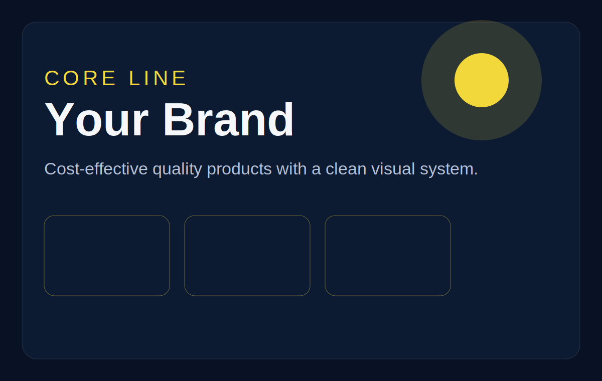

# Luma website starter

This is a simple static website starter for **Luma**, designed for easy GitHub + Vercel deployment.

## Edit these first

- `index.html` for page structure and copy
- `styles.css` for colors and layout
- `script.js` for brand cards
- `assets/brands/` for brand images
- `assets/products/` for product or lifestyle images
- `assets/ui/` for logos and interface graphics

## Image paths

Example image link in HTML:

```html

```

Example image path in JavaScript:

```js
image: 'assets/brands/brand-placeholder-1.svg'
```

## GitHub push steps

After creating a new empty GitHub repo, run:

```bash
git init
git add .
git commit -m "Initial Luma site"
git branch -M main
git remote add origin YOUR_GITHUB_REPO_URL
git push -u origin main
```

## Vercel

Import the GitHub repository into Vercel.
This project is static, so Vercel should deploy it automatically without extra config.
